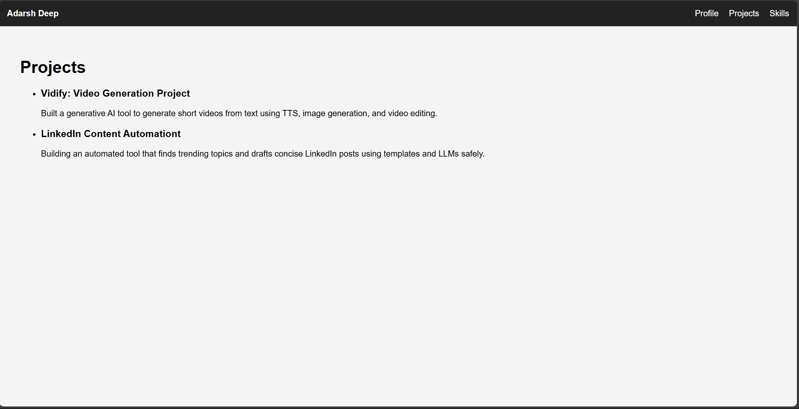
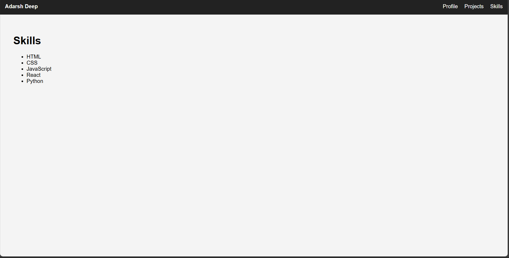

# Personal Portfolio Website

A simple and clean personal portfolio built using **React** and **React Router**.  
It includes a responsive navigation bar with routing between Profile, Projects, and Skills sections.

---

## 🚀 Features

- React-based single page application
- Client-side routing using React Router
- Clean top navigation bar
- Modular and easy-to-extend code structure
- Beginner-friendly project structure

---

## 🛠️ Tech Stack

- React
- React Router DOM
- JavaScript (ES6+)
- CSS (inline styles / basic styling)

---

## 📁 Project Structure

project-root/
│
├── src/
│ ├── components/
│ ├── pages/
│ ├── App.jsx
│ └── main.jsx
│
├── screenshots/
│ ├── home.png
│ ├── projects.png
│ └── skills.png
│
├── public/
├── package.json
└── README.md

## 🖼️ Screenshots

### Home / Profile Page

### Projects Page

### Skills Page
