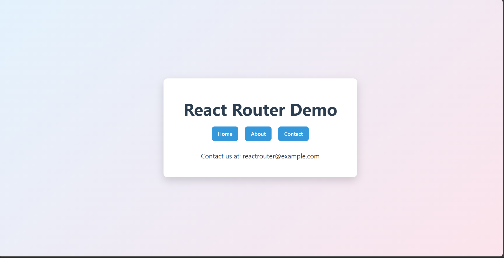
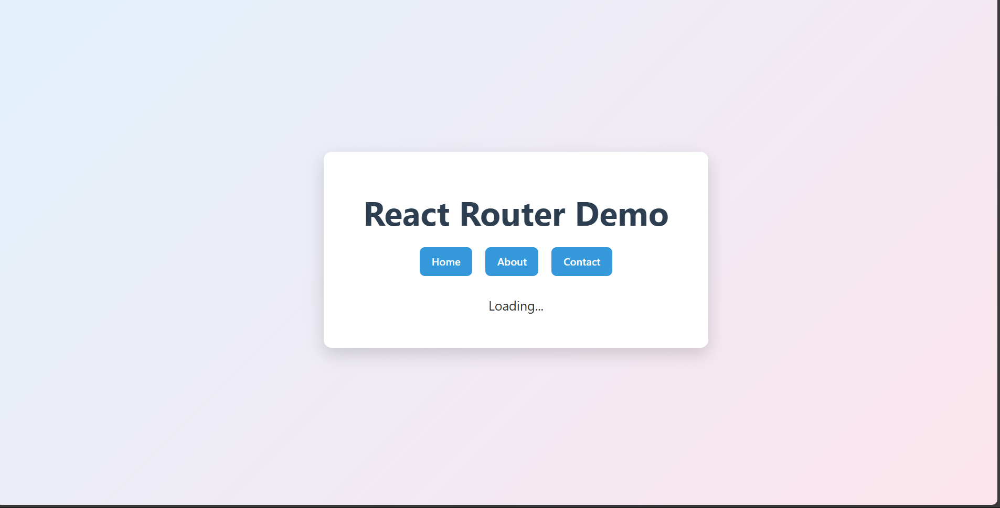

# 🚀 React Router + Lazy Loading Demo

This project demonstrates:

- React Router (v6)
- Route-based navigation
- Code splitting with `React.lazy()`
- Loading states using `Suspense`
- Artificial delay to visualize lazy loading
- Centered responsive UI layout

---

## 📌 Features

- Home, About, and Contact pages
- Navigation using `<Link>`
- Routing using `<Routes>` and `<Route>`
- Lazy loaded components
- Individual Suspense fallback per route
- Artificial 0.8s delay (for demo purposes)

---

## 🛠️ Tech Stack

- React
- React Router DOM
- Vite
- CSS (Flexbox for centering layout)

---

## 📂 Project Structure

src/
│
├── pages/
│ ├── Home.jsx
│ ├── About.jsx
│ └── Contact.jsx
│
├── App.jsx
├── main.jsx
├── App.css
└── index.css

### Dashboard

### Loading Page
