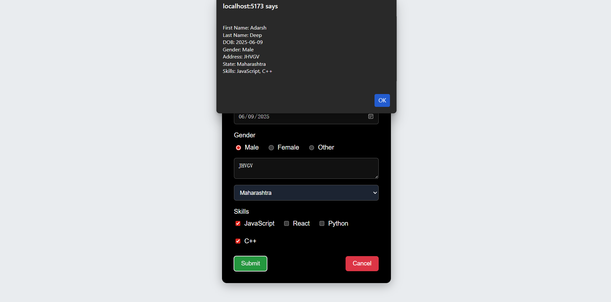
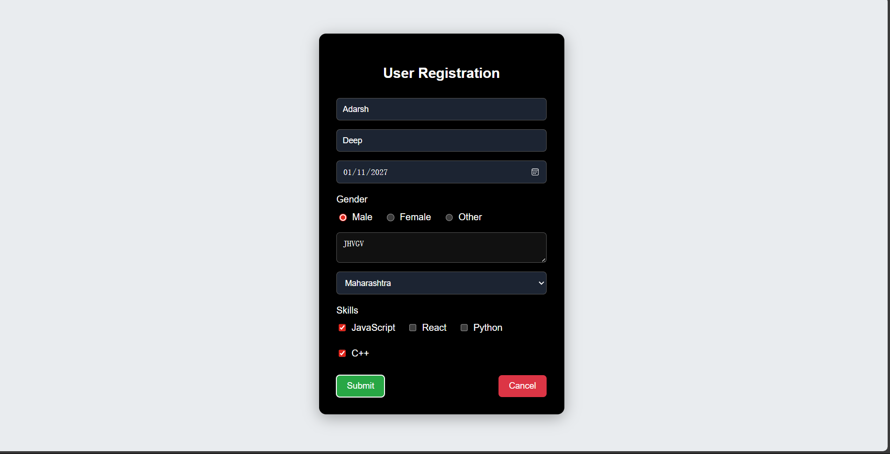

# User Registration Form (React)

A simple **User Registration Form** built using **React.js** demonstrating form handling, controlled components, validation, and state management.

---

## 🚀 Features

- User registration form UI
- Controlled form inputs using React state
- Gender selection using radio buttons
- Multiple skill selection using checkboxes
- Address textarea input
- State dropdown selection
- Prevents future Date of Birth selection
- Form reset using Cancel button
- Responsive centered layout
- Clean dark-themed UI

---

## 🛠️ Technologies Used

- React.js
- JavaScript (ES6)
- HTML5
- CSS3
- React Hooks (`useState`)

---

## 📂 Project Structure
src/
│
├── App.jsx
├── App.css
└── main.jsx

